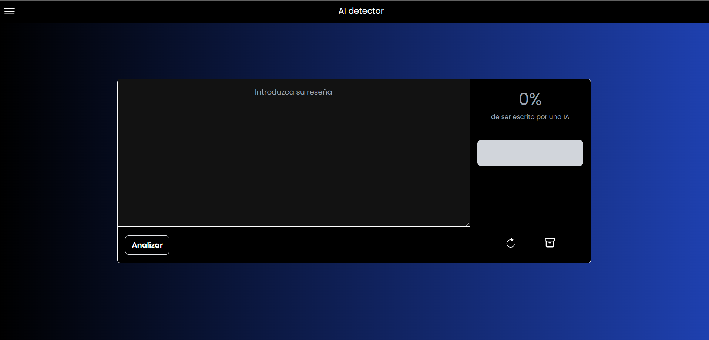
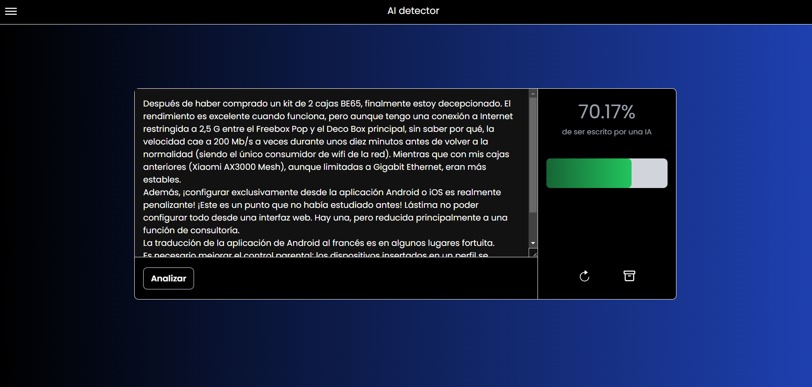

# AI-Review-Interface

_El siguiente repo consiste en una interfaz que detecta si una reseña la ha escrito una ia o una persona utilizando un modelo LSTM_

## Descripción 🚀
 
Basicamente el usuario introduce una reseña en el frontend que es una interfaz creada con ReactJs y si la reseña es válida, la información
será enviada al backend que mediante Flask convierte la reseña en una dataframe con las caractaristicas de los datos de entrenamiento para poder usar un modelo LSTM que devolverá una probabilidad de cuanto de probable es que el texto haya sido escrito por una IA. El usuario podrá refrescar la reseña o guardarala.

- 
- 

# Instalación 📋

_Que cosas necesitas para instalar el software y como instalarlas_

## 1. Clona este repositorio

''
`git clone https://github.com/Pabarkyan/AI-Review-Interface.git`

`cd [nombre del repo]`
''

## 2. Backend

`cd backend`

#### Archivo backend/.env
 - FLASK_APP=app.py

 - FLASK_ENV=development

`python -m venv venv`

`source venv/bin/activate` # En Windows usa `venv\Scripts\activate`

#### Instalamos dependencias

`pip install -r requirements.txt`

#### Ejecutar el backend

`python app.py`

## 3. Frontend

`cd frontend`

##### Archivo frontend/.env
 - VITE_BACKEND_URL=http://localhost:[puerto donde este tu backend]

`npm install`

#### correr el servidor

`npm run dev`